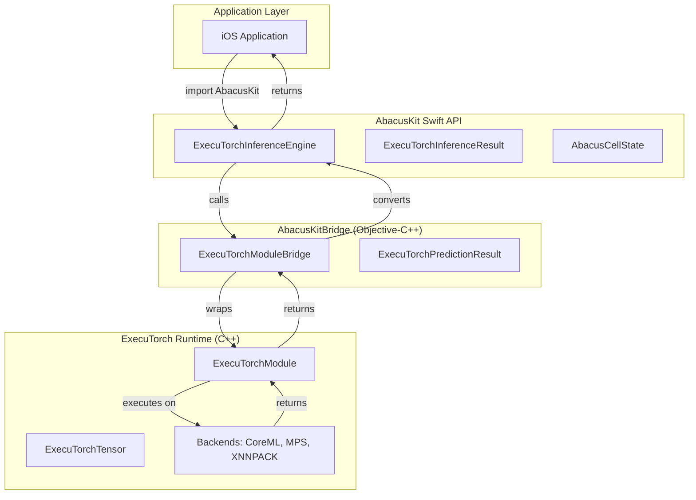
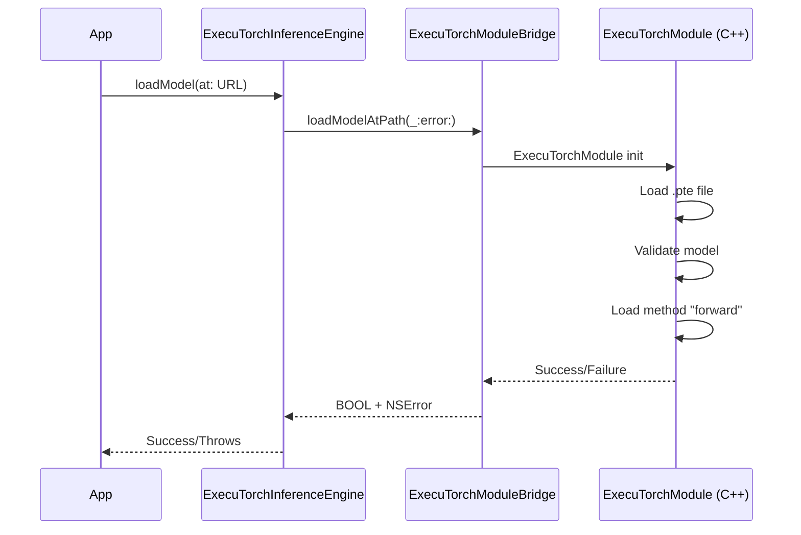
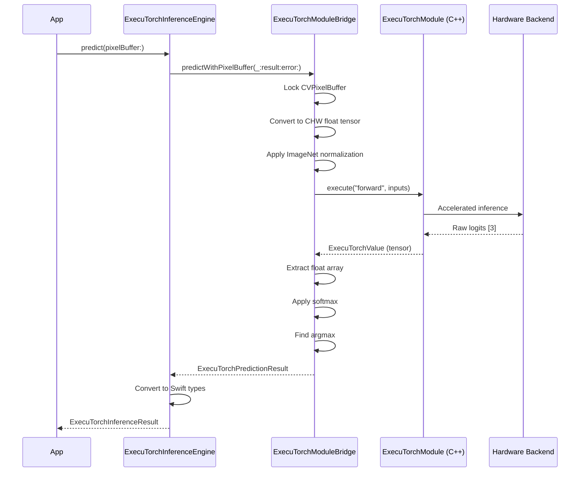

# AbacusKit Architecture

This document provides a comprehensive overview of AbacusKit's architecture, design patterns, and component interactions.

## Table of Contents

- [System Overview](#system-overview)
- [Architecture Layers](#architecture-layers)
- [Core Components](#core-components)
- [Data Flow](#data-flow)
- [Threading Model](#threading-model)
- [Design Patterns](#design-patterns)

## System Overview

AbacusKit is an iOS SDK for real-time abacus cell state detection using ExecuTorch-based machine learning inference. The SDK is designed with a two-layer architecture that bridges Swift and C++ to leverage PyTorch's ExecuTorch runtime.



### Key Design Principles

1. **Clean Architecture**: Clear separation of concerns across layers
2. **Type Safety**: Leverages Swift's strong type system
3. **Concurrency**: Uses Swift actors for thread-safe operations
4. **Interoperability**: Seamless Swift ↔ C++ bridge via Objective-C++
5. **Performance**: Hardware-accelerated inference via multiple backends

## Architecture Layers

### Layer 1: Swift API (`AbacusKit`)

**Purpose**: Provide a type-safe, Swift-native API for iOS applications.

**Key Types**:
- `ExecuTorchInferenceEngine`: Main actor-based inference engine
- `AbacusCellState`: Enum representing abacus cell states (upper, lower, empty)
- `ExecuTorchInferenceResult`: Structured result with predictions and probabilities
- `ExecuTorchInferenceError`: Swift-native error handling

**Responsibilities**:
- Public API surface for consumers
- Type-safe abstractions over C++ types
- Actor-based concurrency management
- Error handling translation

### Layer 2: Bridge (`AbacusKitBridge`)

**Purpose**: Bridge Swift and ExecuTorch's C++ API using Objective-C++.

**Key Classes**:
- `ExecuTorchModuleBridge`: Objective-C interface to ExecuTorch
- `ExecuTorchPredictionResult`: C-struct compatible result type

**Responsibilities**:
- Memory management between Swift and C++
- Type conversion (Swift types ↔ C++ types)
- ExecuTorch module lifecycle management
- Pixel buffer preprocessing and tensor conversion

**Why Objective-C++?**
Swift cannot directly interoperate with C++. Objective-C++ serves as the bridge layer, exposing Objective-C interfaces to Swift while using C++ internally.

### Layer 3: ExecuTorch Runtime

**Purpose**: Execute PyTorch models on-device with hardware acceleration.

**Components**:
- **Core Runtime**: Model loading and execution
- **Backends**: CoreML (Neural Engine), MPS (GPU), XNNPACK (CPU)
- **Tensor Operations**: Optimized tensor computations

## Core Components

### ExecuTorchInferenceEngine (Swift Actor)

```swift
public actor ExecuTorchInferenceEngine {
    private let bridge: ExecuTorchModuleBridge
    private var isLoaded: Bool
    
    public func loadModel(at modelPath: URL) throws
    public func predict(pixelBuffer: CVPixelBuffer) throws -> ExecuTorchInferenceResult
}
```

**Actor Benefits**:
- Guarantees thread-safe access to mutable state
- Prevents data races on `isLoaded` flag
- Safe concurrent model access from multiple tasks

**Usage Pattern**:
```swift
let engine = ExecuTorchInferenceEngine()
try await engine.loadModel(at: modelURL)
let result = try await engine.predict(pixelBuffer: frame)
```

### ExecuTorchModuleBridge (Objective-C++)

```objc
@interface ExecuTorchModuleBridge : NSObject

- (BOOL)loadModelAtPath:(NSString *)path error:(NSError **)error;

- (BOOL)predictWithPixelBuffer:(CVPixelBufferRef)pixelBuffer
                        result:(ExecuTorchPredictionResult *)result
                         error:(NSError **)error;

- (BOOL)isModelLoaded;

@end
```

**Internal Implementation**:
- Wraps `ExecuTorchModule` C++ class
- Converts `CVPixelBuffer` → `ExecuTorchTensor`
- Applies ImageNet normalization
- Executes forward pass
- Applies softmax to logits
- Converts results to C-struct

### AbacusCellState (Enum)

```swift
public enum AbacusCellState: Int, Sendable {
    case upper = 0  // 上玉 (upper bead)
    case lower = 1  // 下玉 (lower bead)
    case empty = 2  // 玉なし (no bead)
}
```

Domain-specific type representing the three possible states of an abacus cell.

## Data Flow

### Model Loading Flow



### Inference Flow



### Preprocessing Pipeline

**Input**: `CVPixelBuffer` (typically 224×224 BGRA/RGBA)

**Steps**:
1. **Lock buffer**: `CVPixelBufferLockBaseAddress`
2. **Format detection**: Check pixel format (BGRA vs RGBA)
3. **Channel extraction**: Extract R, G, B from 4-channel buffer
4. **Layout conversion**: HWC → CHW (Height-Width-Channel to Channel-Height-Width)
5. **Normalization**: Apply ImageNet mean/std
   ```
   mean = [0.485, 0.456, 0.406]
   std = [0.229, 0.224, 0.225]
   normalized = (pixel / 255.0 - mean) / std
   ```
6. **Tensor creation**: Wrap as `ExecuTorchTensor` with shape `[1, 3, 224, 224]`

## Threading Model

### Swift Concurrency (Actors)

```swift
// ExecuTorchInferenceEngine is an actor
public actor ExecuTorchInferenceEngine {
    // All methods are async and executed serially
}
```

**Guarantees**:
- All access to engine state is serialized
- No data races on mutable properties
- Automatic suspension at async boundaries

**Usage**:
```swift
Task {
    try await engine.loadModel(at: url)
    try await engine.predict(pixelBuffer: buffer)
}
```

### Objective-C++ Thread Safety

The bridge layer (`ExecuTorchModuleBridge`) is **not** thread-safe. Thread safety is provided by the Swift actor that wraps it.

**Pattern**:
- Swift actor ensures serial access
- Bridge can assume single-threaded access
- No locks needed in Objective-C++ code

## Design Patterns

### 1. Actor Pattern (Concurrency)

**Problem**: Thread-safe access to mutable state  
**Solution**: Use Swift actors to serialize access

```swift
actor ExecuTorchInferenceEngine {
    private var isLoaded: Bool  // Protected by actor
}
```

### 2. Bridge Pattern (Interoperability)

**Problem**: Swift cannot directly call C++ code  
**Solution**: Use Objective-C++ as intermediary

```
Swift → Objective-C interface → Objective-C++ implementation → C++
```

### 3. Result Type Pattern (Error Handling)

**Problem**: Errors can occur at multiple layers  
**Solution**: Domain-specific error types with context

```swift
public enum ExecuTorchInferenceError: Error {
    case modelNotLoaded
    case modelLoadFailed(String)
    case inferenceFailed(String)
    case invalidInput(String)
}
```

### 4. Value Type Pattern (Immutability)

**Problem**: Prevent unintended mutations  
**Solution**: Use structs for data transfer objects

```swift
public struct ExecuTorchInferenceResult: Sendable {
    public let predictedState: AbacusCellState
    public let probabilities: [Float]
    public let inferenceTimeMs: Double
}
```

### 5. Dependency Isolation

**Problem**: C++ dependencies in Swift package  
**Solution**: Separate targets with clear boundaries

```
AbacusKit (Swift, no C++ deps)
    ↓ depends on
AbacusKitBridge (Objective-C++, ExecuTorch deps)
```

## Backend Selection

AbacusKit supports multiple ExecuTorch backends:

| Backend | Hardware | Best For | Latency | Power |
|---------|----------|----------|---------|-------|
| **CoreML** | Neural Engine | Optimized models | Lowest | Lowest |
| **MPS** | GPU | Heavy computation | Low | Medium |
| **XNNPACK** | CPU | Compatibility | Medium | Higher |

The backend is selected automatically by ExecuTorch based on model compilation and device capabilities.

## Memory Management

### Swift ↔ Objective-C++

- **Swift**: Automatic Reference Counting (ARC)
- **Objective-C++**: ARC for Obj-C objects, manual for C++
- **Bridge**: Uses `NSData` for safe buffer passing

### CVPixelBuffer Lifecycle

```cpp
CVPixelBufferLockBaseAddress(pixelBuffer, kCVPixelBufferLock_ReadOnly);
// ... process buffer ...
CVPixelBufferUnlockBaseAddress(pixelBuffer, kCVPixelBufferLock_ReadOnly);
```

**Important**: Always unlock after processing to prevent memory leaks.

### Tensor Memory

ExecuTorch manages tensor memory internally. The bridge creates temporary `NSMutableData` for preprocessing, which is automatically released by ARC.

## Performance Considerations

### Initialization Cost

- **Model Loading**: 100-500ms (one-time cost)
- **Memory Footprint**: ~50-200MB depending on model size

### Inference Cost

- **Preprocessing**: ~5-10ms (CPU)
- **Inference**: 10-50ms (varies by backend and model)
- **Postprocessing**: <1ms

### Optimization Tips

1. **Load model once**: Reuse `ExecuTorchInferenceEngine` instance
2. **Reuse pixel buffers**: Avoid allocation overhead
3. **Choose right backend**: CoreML for production, XNNPACK for testing
4. **Model quantization**: Use INT8 quantization for faster inference

## Error Handling Strategy

### Layered Error Handling

```
Swift Layer: ExecuTorchInferenceError (domain-specific)
    ↓
Bridge Layer: NSError (Objective-C compatible)
    ↓
C++ Layer: torch::executor::Error (ExecuTorch native)
```

### Error Propagation

```swift
do {
    let result = try await engine.predict(pixelBuffer: buffer)
} catch ExecuTorchInferenceError.modelNotLoaded {
    // Handle specific error
} catch {
    // Handle general error
}
```

## Testing Strategy

### Unit Testing

- **Swift Layer**: Mock `ExecuTorchModuleBridge` protocol
- **Bridge Layer**: Test with synthetic pixel buffers
- **Integration**: End-to-end tests with real models

### Performance Testing

```swift
let start = CFAbsoluteTimeGetCurrent()
let result = try await engine.predict(pixelBuffer: buffer)
let elapsed = (CFAbsoluteTimeGetCurrent() - start) * 1000
print("Inference: \(elapsed)ms")
```

## Future Enhancements

- [ ] Batch inference support
- [ ] Dynamic backend selection API
- [ ] Model warmup API
- [ ] Streaming results for real-time video
- [ ] Metal-based preprocessing
- [ ] On-device model updates

---

**Next**: See [API_REFERENCE.md](API_REFERENCE.md) for detailed API documentation.
