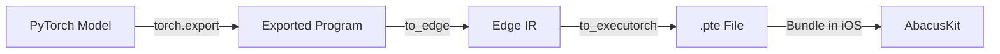

# Model Preparation Guide

This guide explains how to convert PyTorch models to ExecuTorch format (`.pte`) for use with AbacusKit.

## Table of Contents

- [Overview](#overview)
- [Prerequisites](#prerequisites)
- [Installation](#installation)
- [Model Export Process](#model-export-process)
- [Backend Selection](#backend-selection)
- [Model Optimization](#model-optimization)
- [Testing Your Model](#testing-your-model)

## Overview

AbacusKit uses **ExecuTorch**, PyTorch's on-device inference runtime. Models must be exported from PyTorch to the `.pte` (PyTorch ExecuTorch) format before they can be used on iOS.

### Workflow



## Prerequisites

- **Python**: 3.8 or later
- **PyTorch**: 2.0 or later
- **ExecuTorch**: Latest version
- **Your trained model**: In PyTorch format (`.pt` or `.pth`)

## Installation

### Step 1: Create Virtual Environment

```bash
python3 -m venv venv
source venv/bin/activate  # On Windows: venv\Scripts\activate
```

### Step 2: Install PyTorch

```bash
# macOS/Linux (CPU)
pip install torch torchvision

# macOS/Linux (with MPS for Apple Silicon)
pip install torch torchvision --index-url https://download.pytorch.org/whl/cpu
```

### Step 3: Install ExecuTorch

```bash
pip install executorch
```

### Step 4: Install Optional Dependencies

```bash
# For CoreML backend
pip install coremltools

# For quantization
pip install torch-ao
```

## Model Export Process

### Step 1: Prepare Your Model

Your PyTorch model should:
- Be in `torch.nn.Module` format
- Have a well-defined `forward()` method
- Accept fixed-size inputs (e.g., `[1, 3, 224, 224]`)
- Not use dynamic control flow (if/else based on input values)

**Example Model**:
```python
import torch
import torch.nn as nn

class AbacusClassifier(nn.Module):
    def __init__(self):
        super().__init__()
        self.conv1 = nn.Conv2d(3, 32, 3, padding=1)
        self.pool = nn.MaxPool2d(2, 2)
        self.conv2 = nn.Conv2d(32, 64, 3, padding=1)
        self.fc1 = nn.Linear(64 * 56 * 56, 128)
        self.fc2 = nn.Linear(128, 3)  # 3 classes
        
    def forward(self, x):
        x = self.pool(torch.relu(self.conv1(x)))
        x = self.pool(torch.relu(self.conv2(x)))
        x = x.view(x.size(0), -1)
        x = torch.relu(self.fc1(x))
        x = self.fc2(x)
        return x

# Load your trained weights
model = AbacusClassifier()
model.load_state_dict(torch.load('abacus_weights.pth'))
model.eval()
```

### Step 2: Export to ExecuTorch

Create `export_to_executorch.py`:

```python
import torch
from torch.export import export
from executorch.exir import to_edge
from executorch.exir import ExecutorchProgram

# Load your model
model = AbacusClassifier()
model.load_state_dict(torch.load('abacus_weights.pth'))
model.eval()

# Define example input (matching expected input shape)
example_input = torch.randn(1, 3, 224, 224)

# Step 1: Export to torch.export format
exported_program = export(model, (example_input,))

# Step 2: Convert to Edge IR
edge_program = to_edge(exported_program)

# Step 3: Convert to ExecuTorch
executorch_program = edge_program.to_executorch()

# Step 4: Save as .pte file
with open("abacus_model.pte", "wb") as f:
    f.write(executorch_program.buffer)

print("✅ Model exported successfully to abacus_model.pte")
```

### Step 3: Run Export Script

```bash
python export_to_executorch.py
```

**Expected Output**:
```
✅ Model exported successfully to abacus_model.pte
```

## Backend Selection

ExecuTorch supports multiple backends for hardware acceleration. Choose based on your target device and performance requirements.

### Available Backends

| Backend | Hardware | Pros | Cons |
|---------|----------|------|------|
| **CoreML** | Neural Engine | Fastest, lowest power | macOS/iOS only, limited ops |
| **MPS** | GPU | Fast, good compatibility | iOS only, higher power |
| **XNNPACK** | CPU | Universal compatibility | Slower than accelerated |

### CoreML Backend

**Best for**: Production iOS apps with optimized models

```python
from executorch.exir.backend.backend_api import to_backend

# Export with CoreML backend
exported_program = export(model, (example_input,))
edge_program = to_edge(exported_program)

# Lower to CoreML
lowered_module = edge_program.to_backend("CoreMLBackend")
executorch_program = lowered_module.to_executorch()

with open("abacus_coreml.pte", "wb") as f:
    f.write(executorch_program.buffer)
```

**Requirements**:
- Install `coremltools`
- Model must use CoreML-supported operations
- Test on real device (Neural Engine unavailable in simulator)

### MPS Backend

**Best for**: GPU-accelerated inference on iOS

```python
# Export with MPS backend
edge_program = to_edge(exported_program)
lowered_module = edge_program.to_backend("MPSBackend")
executorch_program = lowered_module.to_executorch()

with open("abacus_mps.pte", "wb") as f:
    f.write(executorch_program.buffer)
```

### XNNPACK Backend

**Best for**: CPU-optimized inference, maximum compatibility

```python
from executorch.backends.xnnpack.partition.xnnpack_partitioner import XnnpackPartitioner

# Export with XNNPACK backend
edge_program = to_edge(exported_program)
edge_program = edge_program.to_backend(XnnpackPartitioner())
executorch_program = edge_program.to_executorch()

with open("abacus_xnnpack.pte", "wb") as f:
    f.write(executorch_program.buffer)
```

## Model Optimization

### 1. Quantization

Reduce model size and improve inference speed with INT8 quantization.

```python
import torch
from torch.ao.quantization import quantize_dynamic

# Quantize model
quantized_model = quantize_dynamic(
    model,
    {torch.nn.Linear, torch.nn.Conv2d},
    dtype=torch.qint8
)

# Export quantized model
exported_program = export(quantized_model, (example_input,))
edge_program = to_edge(exported_program)
executorch_program = edge_program.to_executorch()

with open("abacus_quantized.pte", "wb") as f:
    f.write(executorch_program.buffer)
```

**Benefits**:
- 4x smaller model size
- 2-4x faster inference
- Minimal accuracy loss (<1% typically)

### 2. Operator Fusion

Fuse consecutive operations for better performance.

```python
from torch.ao.quantization import fuse_modules

class FusedAbacusClassifier(nn.Module):
    def __init__(self, original_model):
        super().__init__()
        self.features = original_model
        # Fuse Conv + ReLU + MaxPool
        fuse_modules(self.features, [['conv1', 'relu1', 'pool1']], inplace=True)
        
# Apply fusion
fused_model = FusedAbacusClassifier(model)
```

### 3. Input Optimization

Ensure your model expects the correct input preprocessing.

```python
# Model should expect ImageNet-normalized inputs
# Mean: [0.485, 0.456, 0.406]
# Std: [0.229, 0.224, 0.225]

# During training, use the same normalization:
from torchvision import transforms

transform = transforms.Compose([
    transforms.Resize((224, 224)),
    transforms.ToTensor(),
    transforms.Normalize(mean=[0.485, 0.456, 0.406],
                        std=[0.229, 0.224, 0.225])
])
```

## Testing Your Model

### Step 1: Verify Export

```python
# Check file size
import os
file_size = os.path.getsize('abacus_model.pte')
print(f"Model size: {file_size / 1024 / 1024:.2f} MB")

# Expected: 5-50 MB for typical models
```

### Step 2: Test Inference (Python)

```python
from executorch.extension.pybindings.portable_lib import (
    _load_for_executorch,
)

# Load model
model_path = "abacus_model.pte"
executorch_module = _load_for_executorch(model_path)

# Run inference
input_tensor = torch.randn(1, 3, 224, 224)
output = executorch_module.forward([input_tensor])

print(f"Output shape: {output[0].shape}")
print(f"Output: {output[0]}")
```

### Step 3: Validate Accuracy

```python
import torch
import numpy as np

# Load original model
original_model = AbacusClassifier()
original_model.load_state_dict(torch.load('abacus_weights.pth'))
original_model.eval()

# Compare outputs
test_input = torch.randn(1, 3, 224, 224)

with torch.no_grad():
    original_output = original_model(test_input)
    executorch_output = executorch_module.forward([test_input])[0]

# Check if outputs are close
difference = torch.abs(original_output - executorch_output).max()
print(f"Max difference: {difference.item()}")

# Should be < 0.01 for non-quantized models
# Should be < 0.1 for quantized models
```

## Complete Export Script

Here's a complete, production-ready export script:

```python
#!/usr/bin/env python3
"""
Export PyTorch model to ExecuTorch format (.pte)
"""

import argparse
import os
import torch
from torch.export import export
from executorch.exir import to_edge

def export_model(
    model_path: str,
    output_path: str,
    input_shape: tuple = (1, 3, 224, 224),
    backend: str = "default"
):
    """Export PyTorch model to ExecuTorch format"""
    
    print(f"Loading model from {model_path}...")
    model = torch.load(model_path)
    model.eval()
    
    print(f"Creating example input with shape {input_shape}...")
    example_input = torch.randn(*input_shape)
    
    print("Exporting model...")
    exported_program = export(model, (example_input,))
    
    print("Converting to Edge IR...")
    edge_program = to_edge(exported_program)
    
    if backend != "default":
        print(f"Applying {backend} backend...")
        edge_program = edge_program.to_backend(f"{backend}Backend")
    
    print("Converting to ExecuTorch...")
    executorch_program = edge_program.to_executorch()
    
    print(f"Saving to {output_path}...")
    with open(output_path, "wb") as f:
        f.write(executorch_program.buffer)
    
    file_size = os.path.getsize(output_path)
    print(f"✅ Export successful!")
    print(f"   Output: {output_path}")
    print(f"   Size: {file_size / 1024 / 1024:.2f} MB")

if __name__ == "__main__":
    parser = argparse.ArgumentParser(description="Export PyTorch to ExecuTorch")
    parser.add_argument("--input", required=True, help="Input .pt model path")
    parser.add_argument("--output", required=True, help="Output .pte path")
    parser.add_argument("--backend", default="default", 
                       choices=["default", "CoreML", "MPS", "XNNPACK"],
                       help="Backend to use")
    
    args = parser.parse_args()
    export_model(args.input, args.output, backend=args.backend)
```

**Usage**:
```bash
python export_model.py --input model.pt --output model.pte --backend CoreML
```

## Troubleshooting

### Error: "Unsupported operator"

**Cause**: Your model uses operations not supported by ExecuTorch

**Solution**:
1. Check [ExecuTorch operator coverage](https://pytorch.org/executorch/stable/ir-ops-set-definition.html)
2. Replace unsupported ops with supported alternatives
3. Use XNNPACK backend for broader op support

### Error: "Dynamic shapes not supported"

**Cause**: Model uses dynamic control flow or shapes

**Solution**:
- Use fixed input sizes
- Remove dynamic if/else based on tensor values
- Use static shape inference

### Model Too Large

**Cause**: Model exceeds memory limits

**Solution**:
1. Apply INT8 quantization
2. Use pruning to remove unused weights
3. Reduce model architecture size

---

**Next**: See [PERFORMANCE.md](PERFORMANCE.md) for optimization techniques.
